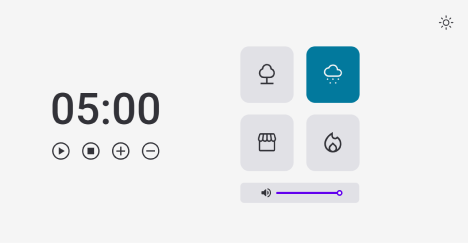

# Timer - Pomodoro

Este projeto foi feito para quem deseja marcar seu tempo de ficar em foco e de descansar. 

Com 4 sons de fundo a disposição.

## Sobre o Desenvolvimento

Este site responsivo foi feito feito com HTML, CSS e JavaScript **puro**. Com intuito de aprofundar nas bases do front-end, utilizando a programação declarativa, factorys e recursividade.

Ele possui os temas Light e Dark. Além de total controle sobre o som disponibilizado no site.

## Feedback

Se você tiver algum feedback, por favor me deixe saber por meio de cristianalves199@gmail.com

